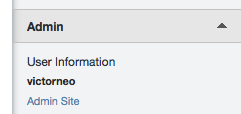

# Helpscout Django

Do you use [Help Scout](https://www.helpscout.net/) for handling customer
queries and Django for your website or backend?

Helpscout Django is a Flask template which allows you setup custom app integration on Help Scout
to display information on your users database on Django. An example of such integration can be
seen in this screenshot:

It is easy to get started! Simply edit the configuration file to point to your PostgreSQL (for now)
instance, and the web app will be ready. It is also fully customizable to your liking.

If you have not configured a Help Scout custom app before, please read their
[Developer Documentation for Custom Apps](http://developer.helpscout.net/custom-apps/)
before proceeding. This would save you from having tons of headaches later.

## Requirements

    Python >= 2.6

At this stage, this project is only tested on Python 2.x. Support for Python
3.3 will be coming very soon!

## Getting Started

First, clone the project off Github to your server, as Help Scout
requires a publicly accessible IP / Domain to access the Flask instance.
Then, install the requirements (preferbly into a virtualenv) before
editing the configuration file:

    pip install -r requirements.txt
    # copy config.example.py to config.py
    # edit config.py

    cp config.example.py config.py
    $EDITOR config.py

Notable configurations:

- `HELPSCOUT_SECRET`: This is the secret key you have set when creating a Help Scout custom app.
- `DB_HOST`, `DB_NAME`, ...: Database connection parameters to your Django PostgreSQL database.

By default, Help Scout will force a HTTPS connection to your predefined callback URL when
setting up the custom app. For debugging purpose, you can enable Debug mode for your
custom app to use HTTP.

** Warning **: Do not use plain HTTP after debugging!

You can run the Flask development server by running the following command:

    python manage.py runserver

The default callback URL is `http://<your-server-ip-or-domain/get-user/`

Point your callback URL for your custom app to the server, and check there are any
misconfigrations. If all is well, you should see the following reply from the Flask
application:

    {'html': '<h3>some-username</h3>'}

## Customizations

#### HTML output

The HTML output is rendered using Jinja2's templating engine. You can modify
the default template by editing this file: `helpscout_django/templates/api/helpscout.html`

#### SQL queries

This Flask template uses [MoSQL](http://mosql.mosky.tw/), a lightweight Database library
which allows queries to be constructed using Python data structures. More complicated
queries can be constructed using `join` and `select` helpers from the library.

Of course, there is nothing stopping you from running SQLAlachemy to handle your database
needs.

#### Callback endpoints

This callback API endpoints are available as a Flask blueprint. You can modify the callback
URL or add your own endpoints by editing the `helpscout_django/api/views.py` file.

## Upcoming plans

Pull requests are welcome for the following features, or any feature requests you may have.

- Python 3.x support
- Support for more databases apart from the default PostgreSQL at the moment
- Better docs!

## License

Copyright 2014 Carousell Pte Ltd

Licensed under the Apache License, Version 2.0 (the "License");
you may not use this file except in compliance with the License.
You may obtain a copy of the License at

    http://www.apache.org/licenses/LICENSE-2.0

Unless required by applicable law or agreed to in writing, software
distributed under the License is distributed on an "AS IS" BASIS,
WITHOUT WARRANTIES OR CONDITIONS OF ANY KIND, either express or implied.
See the License for the specific language governing permissions and
limitations under the License.
